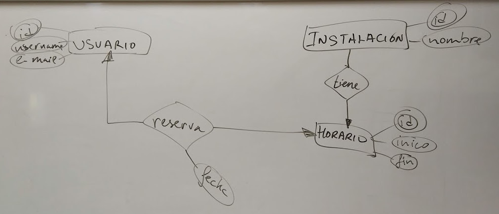

# Tema 02: Conectividad con Bases de Datos Relacionales

## GESTION DE RESERVAS

Con esta práctica de clase vamos a ver:

1. El desfase objeto-relacional.
2. Gestores de bases de datos embebidos e independientes.
3. Protocolos de acceso a bases de datos. Conectores.
4. Establecimiento de conexiones.
5. Definición de objetos destinados al almacenamiento del resultado de operaciones con bases de datos. Eliminación de objetos finalizada su función.
6. Ejecución de sentencias de descripción de datos.
7. Ejecución de sentencias de modificación de datos.
8. Ejecución de consultas.
9. Utilización del resultado de una consulta.
10. Ejecución de procedimientos almacenados en la base de datos.
11. Gestión de transacciones.

## El problema

Se trata de diseñar un sistema de gestión de reservas con usuarios e instalaciones configurables.



Con disparadores controlaremos temas como:

1. Que un usuario no pueda hacer más de una reserva en un día dado.
2. Que no se puedan hacer reservas con más de una semana de antelación.

Con filtros controlaremos que:

1. Sólo los usuarios identificados correctamente pueden hacer reservas
2. Un usuario no pueda modificar reservas de otro usuario
3. Sólo los usuarios identificados puedan hacer reservas
4. Los usuarios administradores son los únicos que pueden crear/actualizar/borrar usuarios


## Preparando el entorno

Para completar esta práctica necesitamos tener instalada una JDK (al menos 1.8 o 
superior), Tomcat 7 o superior (lo vamos a usar como dependencia Maven), 
MySQL Server (usaremos un contenedor Docker), Maven, Git, y como IDE:
Microsoft Visual Studio Code (plugins Java Extension Pack, Java Code Generators,
Tomcat for Java y MySQL -extensión por Jun Han-).

No es necesario, pero si usamos MySQL como contenedor Docker, es más cómodo usar Linux (si no, 
tendremos que cambiar la IP del host o servidor de la base de datos a la máquina virtual Linux
en la que creamos los contenedores).

## Clonando el proyecto

```console

$ git clone https://gitlab.iesvirgendelcarmen.com/juangu/tema02CRUD

```

## Creando los contenedores para la base de datos

Para crear los contenedores con la base de datos y una pequeña intefaz gráfica para poder ejecutar comandos SQL y examinar tablas y datos de manera sencilla, usamos el fichero [docs/stack.yml](docs/stack.yml) de la siguiente manera:

```bash
$ docker-compose -f stack.yml up -d 
```
Ten cuidado al manipular el fichero YML pues es un lenguaje de marcas tabulado, es decir, los bloques se anidan con tabulaciones.

Fíjate que en la opción "restart". En producción deberás poner "always", pero ahora para desarrollo lo dejamos en "no" para forzar nosotros cuando correr o parar los contenedores con las órdenes (iniciar, parar, desactivar inicio automático con el anfitrión, activar inicio automático con el anfitrión):

```bash
$ docker start docker_adminer_1 docker_db_1
$ docker stop docker_adminer_1 docker_db_1
docker container update --restart=no docker_adminer_1 docker_db_1
docker container update --restart=yes docker_adminer_1 docker_db_1
```

